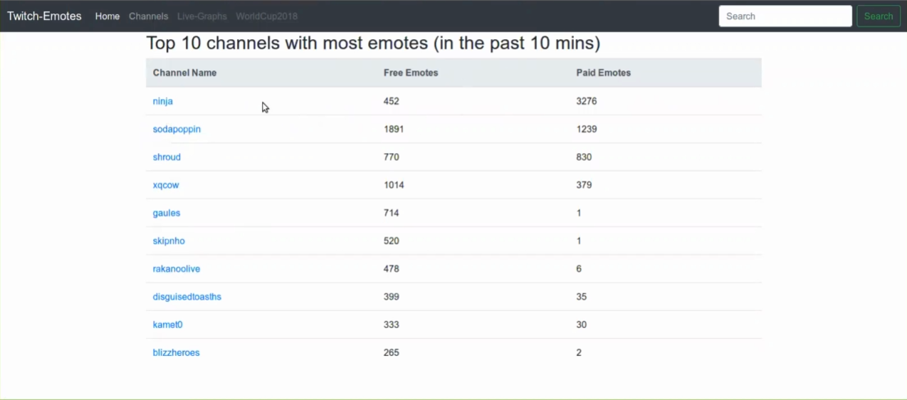
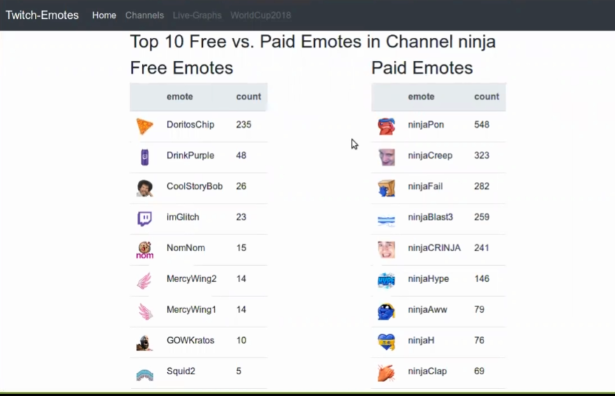
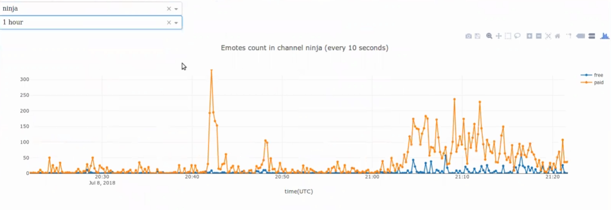
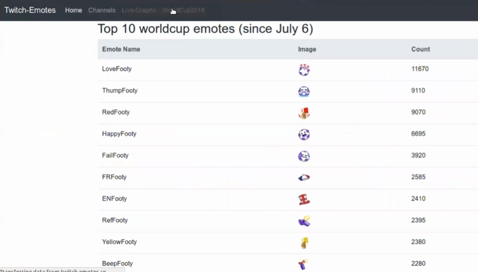
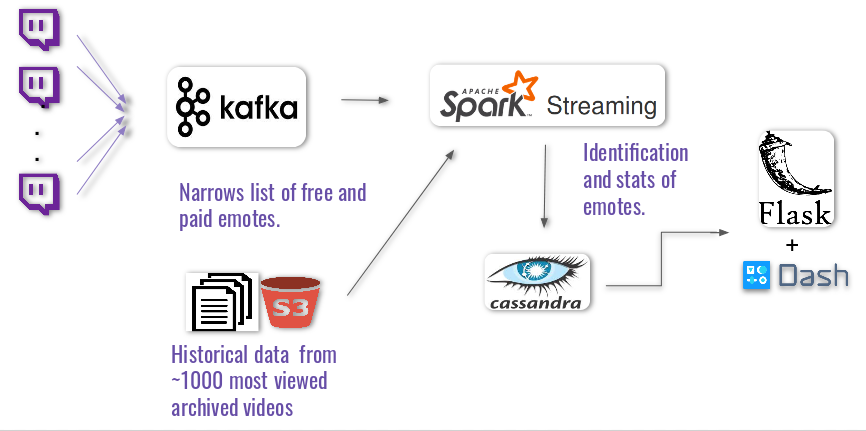

[link_to_slides](https://www.slideshare.net/slideshow/embed_code/key/gGbeGLC0j0CvZO)

[link_to_demo_video](https://youtu.be/wzxTnE7EMcE)

# Table of Contents
1. [Description](README.md#description)
2. [Motivation](README.md#motivation)
3. [Goals](README.md#goals)
4. [Pipeline](README.md#pipeline)
5. [To-do](README.md#to-do)

# Description
A real-time data pipeline for analyzing ztwitch chat data. Specially designed to track and analyze the global (free) and subscribed 
(paid) emotes embedded in chat messages from up to 1000 active channels. Written mostly in python. Deployed entirely on Amazon AWS. 

# Motivation
More than 300 general emotes are free to use for any streaming channels in Twitch.tv, however, there are around 1 Million of unique paid emotes users have to pay monthly in order to use in twitch. The subscription fee of the latter actually contribute a lot to the income of not only Twitch but also the gamers. Tracking and analyzing the paid/free meotes usage in real-time is therefore help twitch/gamers to form better marketing plans and business strategies. 

# Goals
For demonstrations, this pipeline is built to fullfill the following three purposes:
1) Find out the relative popularity of paid vs free emotes for various channel (see Fig.1);
2) Find out the most popular paid and free emotes for a given channel (see Fig.2 and Fig.3);
3) Find the trending emotes of a specific topic, say WorldCup 2018 (see Fig.4).

  

 Fig.1 Top 10 live channels with most emotes usages in real-time. 

    

 Fig.2 Top 10 free vs. paid emotes in one channel in real-time. 

    

 Fig.3 Dynamic plots which monitor the free/paid emotes usage over the past 1 hour. 

 

    

 Fig.4 Top 10 "Footies" (WorldCup2018 theme emotes) based on running sum till July 20th,2018 

# Pipeline

 Fig.5 Data pipeline illustrates the work flow. 

As show in Fig.5, the IRC bots listen to hundreds of live channels in parallel, and spit chat messages to the message queue Kafka cluster. Kafka distributed the incoming message to consumers, the spark streaming process, to do the emotes identification and simple analysis work. The final results are broken into multiple tables and stored in Cassandra cluster and the latter could be queried by the front-end web server implemented with both flask and dash. The whole system is designed to be real-time with high throughput rate (<~ 10^3 events/second) and low latency (<~100 ms). 

# To-do
1) more functionality in the analysis: e.g., including the user information who used the emotes
2) expand to a complete emote set (challenging but do-able) and monitoring more channels
3) automate schedule/monitor the workflow with tools such as airflow

# Other packages
special thanks to the following pkg developers.
1) twitch api python wrapper: [python-twitch-client](https://github.com/tsifrer/python-twitch-client) used to get the channel/emotes information
2) light weight bots: [python-twitch-stream](https://github.com/317070/python-twitch-stream) modified to extract chat messages
3) historic data downloader: [twitch-chat-downloader](https://github.com/PetterKraabol/Twitch-Chat-Downloader) modified to download archived data in parallel. 

